# Piano Keys - Mermaid Diagrams for Embedded Documentation

This file contains Mermaid diagram definitions that can be embedded in Markdown documentation, GitHub README files, and other documentation systems.

## Backend Engineer Diagrams

### API Architecture


### Authentication Flow

```mermaid
sequenceDiagram
    participant User
    participant Client as React Client
    participant API as FastAPI Gateway
    participant Auth as JWT Auth (deps.py)
    participant DB as PostgreSQL

    User->>Client: Enter credentials
    Client->>API: POST /api/v1/auth/login
    API->>Auth: Validate credentials
    Auth->>DB: Query user
    DB-->>Auth: User data
    Auth->>Auth: Generate JWT token
    Auth-->>API: JWT token
    API-->>Client: Return token
    Client->>Client: Store token (localStorage)

    Note over Client,API: Subsequent requests
    Client->>API: Request + JWT token
    API->>Auth: Verify JWT (deps.py)
    Auth-->>API: User object
    API-->>Client: Protected resource

    Note over Auth: ⚠️ CRITICAL: Fix auth bypass<br/>in deps.py lines 30-48
```



### Database Schema


### Module Dependencies


## QA Engineer Diagrams

### Test Pyramid


### Testing Workflow

```mermaid
flowchart TD
    Start([Developer commits code]) --> PreCommit[Pre-commit hooks run]
    PreCommit --> UnitTests[Unit tests execute<br/>Vitest/Pytest]
    UnitTests --> IntTests[Integration tests run]
    IntTests --> E2ETests[E2E tests run<br/>Playwright]
    E2ETests --> Coverage[Coverage report generated]
    Coverage --> QualityGate{Quality gate<br/>≥80% coverage?}

    QualityGate -->|Pass| Deploy[Deploy to staging/production]
    QualityGate -->|Fail| Block[❌ Block deployment]

    Block --> Fix[Fix issues]
    Fix --> Start

    Deploy --> Success([✅ Deployment successful])

    style UnitTests fill:#C8E6C9
    style IntTests fill:#FFF9C4
    style E2ETests fill:#FFCDD2
    style QualityGate fill:#BBDEFB
    style Block fill:#FFEBEE
```



## DevOps Engineer Diagrams

### CI/CD Pipeline


### Infrastructure Architecture


## Security Engineer Diagrams

### Security Architecture


### Threat Model

```mermaid
graph TD
    subgraph "Threats"
        T1[🔴 Authentication Bypass<br/>OWASP A01]
        T2[🔴 Hardcoded Secrets<br/>OWASP A02]
        T3[🟡 SQL Injection<br/>OWASP A03]
        T4[🟡 XSS Attacks<br/>OWASP A03]
        T5[🟢 CSRF<br/>OWASP A08]
    end

    subgraph "Mitigations"
        M1[✅ Fix deps.py<br/>Proper JWT validation]
        M2[✅ Environment variables<br/>Vault secrets]
        M3[✅ Parameterized queries<br/>SQLAlchemy ORM]
        M4[✅ Input sanitization<br/>Pydantic validation]
        M5[✅ CSRF tokens<br/>SameSite cookies]
    end

    T1 -.->|Mitigated by| M1
    T2 -.->|Mitigated by| M2
    T3 -.->|Mitigated by| M3
    T4 -.->|Mitigated by| M4
    T5 -.->|Mitigated by| M5

    style T1 fill:#FFCDD2
    style T2 fill:#FFCDD2
    style T3 fill:#FFF9C4
    style T4 fill:#FFF9C4
    style T5 fill:#C8E6C9
```



## Database Administrator Diagrams

### Migration Flow (SQLite → PostgreSQL)


### Caching Architecture


## UX Designer Diagrams

### User Journey Map


### Information Architecture


## Technical Writer Diagrams

### Documentation Structure


### Documentation Workflow

```mermaid
flowchart TD
    Start([Code Change]) --> AutoGen[Auto-generate API docs<br/>OpenAPI/TypeDoc]
    AutoGen --> Review[Technical review<br/>Accuracy check]
    Review --> Edit[Edit & enhance<br/>Add examples]
    Edit --> Validate[Validate<br/>Links, formatting]
    Validate --> Publish{Ready to publish?}

    Publish -->|Yes| Deploy[Deploy to docs site<br/>Vercel/Netlify]
    Publish -->|No| Edit

    Deploy --> Verify[Verify deployment<br/>Check live site]
    Verify --> Done([✅ Published])

    style AutoGen fill:#C8E6C9
    style Review fill:#FFF9C4
    style Deploy fill:#BBDEFB
```



---

## Usage Instructions

### Rendering Mermaid Diagrams

**In GitHub README:**
```markdown


**In Markdown Processors (Obsidian, Notion, etc.):**
Most modern markdown processors support Mermaid natively.

**Live Mermaid Editor:**
- Visit: https://mermaid.live
- Paste diagram code
- Export as PNG/SVG

**In Documentation Sites:**
- **Docusaurus:** Install `@docusaurus/theme-mermaid`
- **MkDocs:** Install `mkdocs-mermaid2-plugin`
- **VuePress:** Install `vuepress-plugin-mermaidjs`

---

## Diagram Categories

| Role | Diagrams Available |
|------|-------------------|
| Backend Engineer | API Architecture, Auth Flow, DB Schema, Module Dependencies |
| Frontend Engineer | Component Hierarchy, State Management, Routing, Data Flow |
| DevOps Engineer | CI/CD Pipeline, Infrastructure, Deployment, Monitoring |
| Security Engineer | Security Architecture, Threat Model, Auth Flow, Security Layers |
| QA Engineer | Test Pyramid, Test Coverage, Testing Workflow, Test Distribution |
| Database Admin | Schema, Migration Flow, Caching Architecture, Data Flow |
| UX Designer | User Journey, Information Architecture, Component Library, Accessibility |
| Technical Writer | Docs Structure, Info Hierarchy, Content Types, Docs Workflow |

---

**Generated:** December 15, 2025
**Version:** 1.0
**Total Mermaid Diagrams:** 20+
